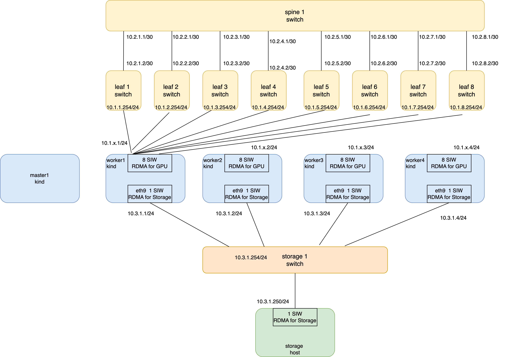

# AI Kind RDMA Lab

本设计文档描述如何使用 `simple-topogoly/setup.sh` 构建并运行一个面向 AI 训练/推理场景的容器化实验网络。该实验环境在单机上同时启动如下组件：

- 1 台默认运行 Nokia SR Linux 的脊交换机：`spine1`
- 8 台默认运行 Nokia SR Linux 的叶交换机：`leaf1`–`leaf8`
- 1 个 kind 集群：包含 1 个控制平面节点和 N 个工作节点（N 可配置）
- 每个 kind worker 节点额外挂载 9 块以太接口，其中 8 条连接叶交换机、1 条连接独立存储交换机，并通过 Software iWARP（SIW）将以太接口暴露为 RDMA 设备
- 1 台独立的存储交换机：`storage-switch`
- 1 台模拟 RDMA 存储主机：`storage-host`

整套拓扑完全运行在 Docker 容器内，由 containerlab 协调部署，适合进行 RDMA 功能验证、网络连通性以及 Kubernetes 侧集成测试。若需要其它网络操作系统（例如 SONiC 或 Arista cEOS），可通过脚本参数覆盖默认 SR Linux 配置；脚本会对常见 NOS（如 SR Linux、SONiC）自动填充推荐镜像，未在内置列表中的 NOS 需手动指定镜像。




## 目录结构与关键文件

| 文件 | 说明 |
| --- | --- |
| `simple-topogoly/setup.sh` | 主执行脚本，负责生成拓扑、调用 containerlab 部署，并在容器网络空间内创建 Software iWARP（SIW）设备 |

## 主机准备步骤（0 → 1）

以下步骤以 Ubuntu 22.04 为例，其它发行版请根据官方文档替换安装命令。

> 注意：Software iWARP 需要 Linux 内核版本 ≥ 5.3，可通过 `uname -r` 检查。

1. **安装 Docker Engine**
   ```bash
   sudo apt-get update
   sudo apt-get install -y ca-certificates curl gnupg lsb-release
   sudo install -m 0755 -d /etc/apt/keyrings
   curl -fsSL https://download.docker.com/linux/ubuntu/gpg | sudo gpg --dearmor -o /etc/apt/keyrings/docker.gpg
   echo \
     "deb [arch=$(dpkg --print-architecture) signed-by=/etc/apt/keyrings/docker.gpg] https://download.docker.com/linux/ubuntu \
     $(lsb_release -cs) stable" | sudo tee /etc/apt/sources.list.d/docker.list >/dev/null
   sudo apt-get update
   sudo apt-get install -y docker-ce docker-ce-cli containerd.io
   sudo usermod -aG docker "$USER"
   # 重新登录使 docker 组生效
   ```

2. **安装 containerlab**
   ```bash
   curl -sL https://get.containerlab.dev | sudo bash
   ```
   验证：`containerlab version`

3. **安装 kind**
   ```bash
   curl -Lo ./kind https://kind.sigs.k8s.io/dl/v0.23.0/kind-linux-amd64
   chmod +x ./kind
   sudo mv ./kind /usr/local/bin/kind
   ```
   验证：`kind version`

4. **安装 RDMA 工具套件**
   ```bash
   sudo apt-get install -y rdma-core infiniband-diags
   ```
   验证：`rdma link`

5. **启用 Software iWARP 模块**
   ```bash
   sudo modprobe siw
   lsmod | grep '^siw'    # 确认模块已加载
   ```
6. **健全性检查**
   ```bash
   docker info         # Docker 引擎工作正常
   containerlab --help # containerlab 在 PATH
   kind get clusters   # kind 正常执行
   rdma link           # RDMA 命令无错误
   ```

7. **卸载 OFED（如果安装了），OFED 和 SIW 是冲突的**

完成上述准备后，即可执行 `simple-topogoly/setup.sh`。确保当前用户具备 `sudo` 权限，以便脚本加载模块与访问网络命名空间。

## 拓扑生成逻辑

- 默认采用 `kind: nokia_srlinux` 作为脊/叶设备；脚本内置 `ghcr.io/nokia/srlinux:25.7` 作为公开可拉取的默认镜像，可按需使用 `--fabric-image` 覆盖。若切换为 SONiC、cEOS 等其它 NOS，需通过 `--fabric-kind` 与 `--fabric-image` 配置。
- 脊交换机 `spine1` 与 8 台叶交换机共享相同的 Fabric Kind；叶子接口 `e1-1` 上联 `spine1:e1-1`…`e1-8`。
- 脊交换机与每台叶交换机之间的上联链路使用 `/30` 点对点地址，统一从 `10.2.0.0/16` 划分。默认分配遵循：`spine1:e1-x = 10.2.x.1/30`、`leafx:e1-1 = 10.2.x.2/30`，其中 `x` 为叶节点编号（1–8），避免了与其它子网冲突并易于扩展到更多叶节点。
- kind 集群节点命名为 `${LAB_NAME}-cluster`；其控制平面容器为 `${LAB_NAME}-cluster-control-plane`，worker 容器依次为 `${LAB_NAME}-cluster-worker`、`${LAB_NAME}-cluster-worker2`… 默认安装 kind 自带 CNI（kindnet），若希望完全自定义 Pod 网络，可在执行脚本时增加 `--disable-default-cni`。
- 每个 worker 的 `eth1`–`eth8` 分别接入 `leaf1:e1-(1+worker)`…`leaf8:e1-(1+worker)`；额外的 `eth9` 接入独立的存储交换机 `storage-switch:e1-<worker>`。
- 存储交换机 `storage-switch` 连接所有 worker 的 `eth9`，并通过 `storage-host:eth1` 引入一个提供 RDMA 能力的存储端容器。
- worker、control-plane 以及存储主机容器在启动时通过 bind-mount 挂载宿主机的 `/dev/infiniband`，便于容器内直接运行 `ib_write_lat`/`ibv_devinfo` 等 RDMA 工具。
- kind 节点（control-plane 与各 worker）在生成集群配置时通过 `extraMounts` 自动挂载宿主机 `/dev/infiniband`，而存储主机容器则通过 containerlab `binds` 挂载相同目录。若更新了脚本，需要重新执行 `./setup.sh destroy && ./setup.sh deploy` 以让新的挂载设置生效。
- 顶层 `mgmt` 节点默认设置为 `ipv4-subnet: auto` 与 `ipv6-subnet: auto`，避免与宿主机中已有的 Docker 网络冲突。
- `linux` kind 也可使用 containerlab 默认镜像；当需要自定义工具集时，可搭配 `--fabric-image` 与 `--kind-image` 指定替代镜像。

除脊-叶点对点链路外，其余数据平面接口保持“裸链路”状态，便于按照测试需求再行分配子网或交由自定义 CNI 管理。


## SIW 配置流程

部署完成后，脚本会自动完成 Software iWARP（SIW）配置：

1. 检查并加载 `siw` 模块，确保 Software iWARP 驱动可用（内核需 ≥ 5.3）。
2. 为每个 worker 建立网络命名空间符号链接，并在 `eth1`–`eth8`（叶交换机链路）及 `eth9`（存储链路）上创建 `rdma link add <name> type siw netdev <iface>` 形式的 SIW 设备。
3. 为模拟存储主机 `storage-host:eth1` 创建 SIW 设备，为 AI 集群提供 RDMA 存储端点。

这些步骤把 veth 接口转换成虚拟 RDMA 网卡，使容器内的应用（或后续在 kind 节点上运行的 Pod）能够通过 `libibverbs`、RDMA CM 等栈进行功能验证。若需要在容器/Pod 中直接访问 `/dev/infiniband/*`，可在后续的工作负载部署时使用 DaemonSet 或容器运行时挂载方式暴露设备节点。

## 使用方法

```bash

# 部署，默认 4 个 worker（使用内置 SR Linux 镜像 ghcr.io/nokia/srlinux:25.7）
./setup.sh deploy

# 自定义 worker 数量与 lab 名称
./setup.sh deploy --workers 6 --lab-name my-rdma-lab  

# 显示 worker 的 LLDP/IP/RDMA 以及 spine/leaf/storage 交换机与 storage-host 的接口状态
./setup.sh show  

# 销毁拓扑
./setup.sh destroy
```

- 脚本会在当前目录生成 `${LAB_NAME}.clab.yml` 与 `${LAB_NAME}-kind.yaml`，并调用 `containerlab deploy -t ${LAB_NAME}.clab.yml`。
- 若需要查看节点状态，可使用 `containerlab inspect -t <lab>.clab.yml`（在 `simple-topogoly` 目录内）或 `containerlab inspect -t simple-topogoly/<lab>.clab.yml`（在仓库根目录）；也可以通过 `docker ps | grep <lab>` 查看容器。
- 验证 SIW RDMA：
  ```
  sudo ip netns exec <worker-container> rdma link
  sudo ip netns exec <worker-container> rdma dev show
  sudo ip netns exec clab-<lab>-storage-host rdma link
  ```

## 拓扑验证与登录方法

完成部署后，可用下列方式验证交换机与 kind 节点的连通性。

1. **查看 containerlab 拓扑摘要**
   ```bash
   containerlab inspect -t ai-kind-rdma.clab.yml
   ```
   确认所有节点状态为 `running`，并记录每个容器名称。

2. **登录 SR Linux 交换机（例如 `leaf1`）**

   运行手册 https://documentation.nokia.com/srlinux/25-7/html/product/OAM.html

   ```bash
   # 查看所有接口
   docker exec -it clab-ai-kind-rdma-leaf1 sr_cli "show interface brief"

   # 查看接口统计
   docker exec -it clab-ai-kind-rdma-leaf1 sr_cli "info from state interface ethernet-1/1"

   docker exec -it clab-ai-kind-rdma-leaf1 sr_cli "info from state interface irb1 subinterface 0 ipv4"

   # 查看指定接口的邻居
   docker exec -it clab-ai-kind-rdma-leaf1 sr_cli \
      "info from state system lldp interface ethernet-1/1"

   # 查看所有邻居
   docker exec -it clab-ai-kind-rdma-leaf1 sr_cli \
      "show system lldp neighbor"

   ```

3. **登录存储交换机**
   ```bash
   # 查看所有接口
   docker exec -it clab-ai-kind-rdma-storage-switch sr_cli "show interface brief"
   
   # 查看指定接口的邻居
   docker exec -it clab-ai-kind-rdma-storage-switch sr_cli \
      "info from state system lldp interface ethernet-1/1"
   ```

4. **登录 kind 控制面或 worker 容器**
   ```bash
   docker exec -it ai-kind-rdma-cluster-control-plane bash
   # 验证与叶交换机的接口
   ip link show eth1
   exit

   docker exec -it ai-kind-rdma-cluster-worker bash
   ip addr show eth9    # 检查存储链路
   exit
   ```

5. **验证 NodePort/Pod 网络**
   在控制面节点中可运行 `kubectl`：
   ```bash
   docker exec -it ai-kind-rdma-cluster-control-plane kubectl get nodes -o wide
   docker exec -it ai-kind-rdma-cluster-control-plane kubectl get pods -A -o wide
   ```
   确认 worker 节点整体状态为 `Ready`。


## 常见扩展与注意事项

- **IP/路由配置**：可通过 containerlab 的 `exec` 选项或后续 Ansible/脚本，在 Fabric 交换机（SR Linux 或其它指定的 NOS）及 worker 容器上配置 VLAN、子网与静态路由，用于模拟实际训练集群的数据与存储平面。
- **Kubernetes CNI**：脚本默认启用 kind 自带 CNI（kindnet）；若要完全自定义 Pod 网络，可在执行脚本时追加 `--disable-default-cni` 并在 kind 集群内自行部署所需的 CNI 方案（如 Multus + RDMA CNI）。
- **真实性能限制**：Software iWARP（SIW）主要用于协议/功能验证，无法提供硬件 RDMA 的带宽、延迟和拥塞控制特性。若需要更真实的表现，可在同一拓扑模板基础上，将真实 HCA 通过 PCI 直通或 SR-IOV VF 映射进对应容器。
- **清理**：`destroy` 子命令会调用 `containerlab destroy --cleanup`，释放容器与 veth。SIW 设备在命名空间销毁后会自动清除；若需要手动处理，可执行 `sudo rdma link delete <name>` 或 `sudo ip netns delete <worker>`。

通过上述脚本与流程，即可在单机上快速搭建具备 8×叶交换机、1×脊交换机、1×存储交换机及 N×kind worker 的“rail optimized”网络拓扑，同时提供带 SIW 能力的存储主机以支撑 AI 业务功能测试。
